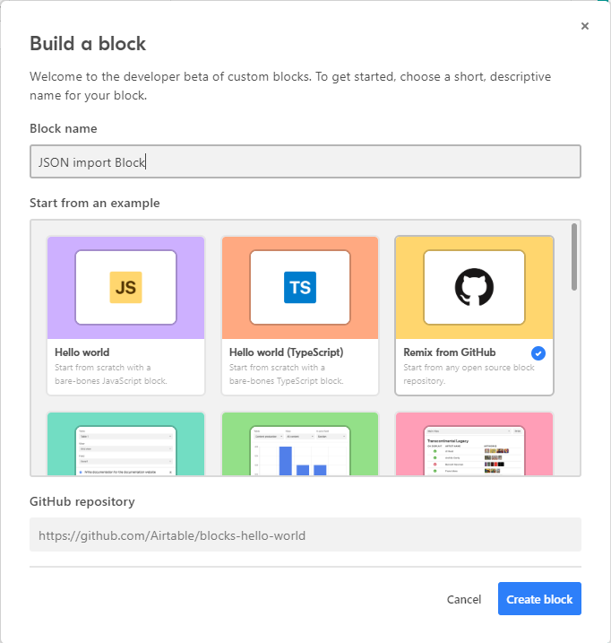
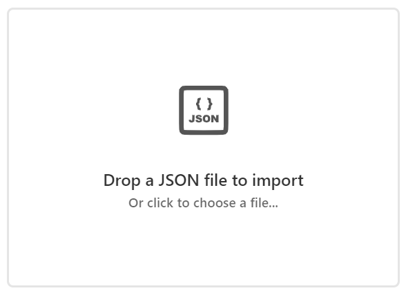
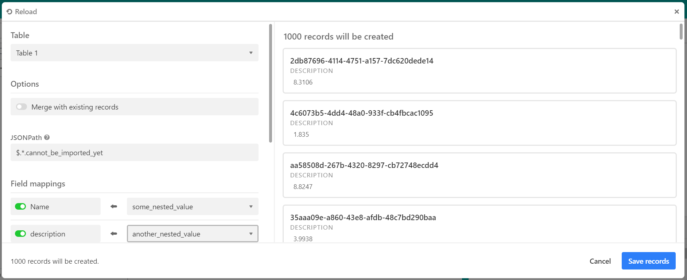

# 📊 JSON Import Block for Airtable
  

Written in TypeScript. Import data from JSON files, and query with [JSONPath](https://jsonpath.com/).

Built by the [SVI Team](https://svi.io). Featured on Airtable's [Developers Blocks](https://airtable.com/developers/blocks/examples).

Looking for help with your software project? Email us to chat at [info@siliconvalleyinsight.com](mailto:info@siliconvalleyinsight.com)!

## Quick Start

### Recommended method: Remix from GitHub

1. On your Airtable base, open the Blocks sidebar on the right, and click **Install a block**
1. On the modal that opens, click **Build a custom block**
1. Select **Remix from GitHub** on the **Build a block** modal
1. Enter `JSON import Block` in the **Block name** field
1. Enter `https://github.com/SiliconValleyInsight/airtable-json-block` in the **GitHub repository** field

    

1. Click **Create block**, and follow the instructions on the next screens to run and test the Block locally

### Manual method (no longer recommended)

1. Clone this git repo
    ```console
    $ git clone git@github.com:SiliconValleyInsight.com/airtable-json-block.git
    ```

1. Install necessary packages with npm

    ```console
    $ cd airtable-json-block/json_import
    $ npm install @airtable/blocks-cli
    $ npm install @airtable/blocks
    $ npm install
    ```

1. Follow [this guide](https://airtable.com/developers/blocks/guides/hello-world-tutorial) to setup a new Block for your base
1. Take note of the Block ID (format: `blkxxxxxxxxx`) and Base ID (format: `appxxxxxxxxx`) from the guide above, modify the `baseID` and `blockID` in [remote.json](.block/remote.json), and save
1. Run `$ block run` and ensure that the Block is running locally
1. On your newly created Block from step 3, enter `htps://localhost:9000` as the URL and click **"Start editing block"**

    

## Developing

- Make sure to follow Airtable's style guides for React and TypeScript (refer to Airtable's developer docs)
- Install [eslint](https://eslint.org/) and [prettier](https://prettier.io/), and make sure to run both before committing a file

## Screenshots



_Block dashboard screen_



_JSON import and mapping screen_
